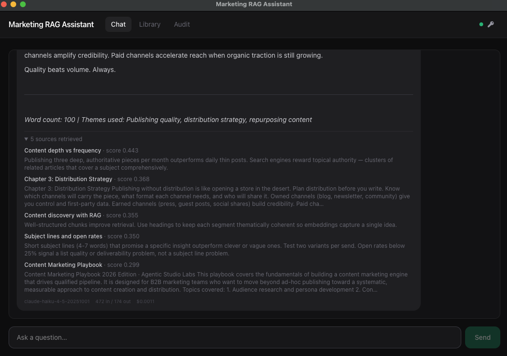
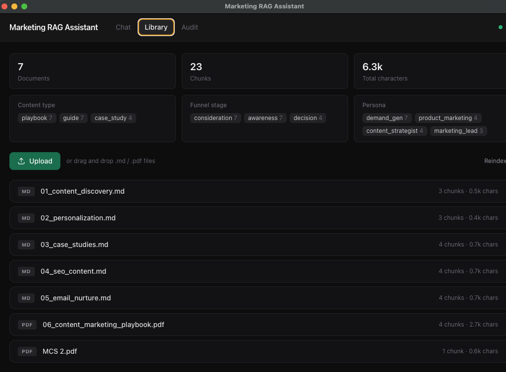
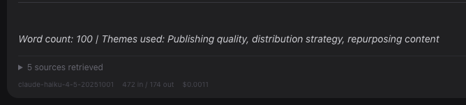
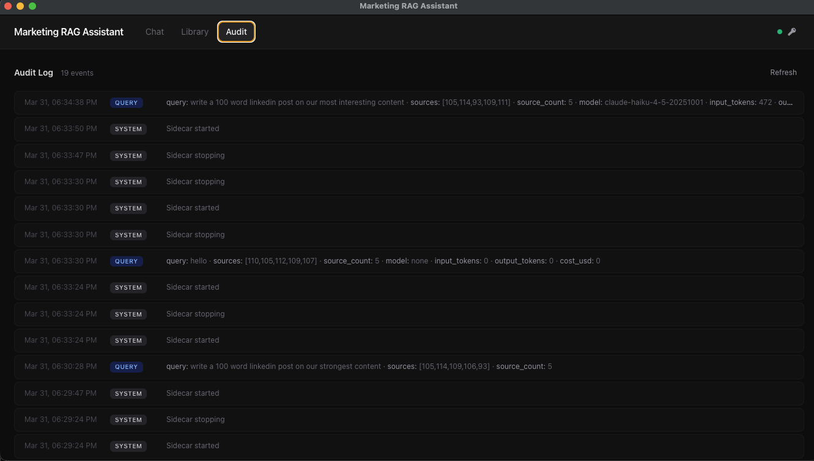

# Marketing RAG Assistant

Local-first **portfolio reference**: Electron + React + FastAPI, with retrieval-augmented generation over a curated content library stored in SQLite. Embeddings run locally (`sentence-transformers`); answers use Anthropic when an API key is configured, otherwise a retrieval-only response.

## Screenshots

| Chat | Library |
|------|---------|
|  |  |

| Cost tracking | Audit trail |
|---------------|-------------|
|  |  |

## Features

| Feature | Description |
|---------|-------------|
| **Chat** | Ask questions about your content library; answers are grounded in retrieved chunks with visible source citations and similarity scores |
| **Library** | Browse indexed documents, inspect individual chunks, view corpus stats by content type / persona / funnel stage, upload new `.md` or `.pdf` files via drag-and-drop |
| **Audit trail** | Every query, upload, reindex, API key change, and error is logged with timestamps, token counts, and estimated cost |
| **PDF + Markdown ingestion** | Heading-aware chunking for markdown, page-level extraction with smart title detection for PDFs |
| **API key management** | Store your Anthropic key securely in macOS Keychain via Electron `safeStorage`; key never touches disk in plaintext |
| **LLM cost tracking** | Token usage and estimated cost shown per response and in the audit log |
| **Markdown rendering** | Assistant responses render headings, lists, bold, and code blocks |

## Prerequisites

- Node.js 20+
- Python 3.12+
- macOS (primary target; other platforms should work with path tweaks)

## Setup

```bash
cd sidecar
python3 -m venv .venv
source .venv/bin/activate   # Windows: .venv\Scripts\activate
pip install -r requirements.txt
cd ..
npm install
```

First run downloads the embedding model ([all-MiniLM-L6-v2](https://huggingface.co/sentence-transformers/all-MiniLM-L6-v2)); expect a short wait.

## Run

```bash
# Terminal 1 — optional: run sidecar alone for debugging
cd sidecar && source .venv/bin/activate && python -m uvicorn api:app --host 127.0.0.1 --port 8420 --reload

# Terminal 2 — desktop app (also starts the sidecar if not already running)
npm run dev
```

Set your API key via the key icon in the top-right corner of the app, or set `ANTHROPIC_API_KEY` as an environment variable.

### Environment (optional)

| Variable | Purpose |
|----------|---------|
| `ANTHROPIC_API_KEY` | Claude API key (or use the in-app key dialog) |
| `ANTHROPIC_MODEL` | Model id (default `claude-haiku-4-5-20251001`) |
| `RAG_DB_PATH` | SQLite file path (default `sidecar/rag.db`; packaged app uses app userData) |
| `RAG_TOP_K` | Chunks to retrieve (default `5`) |
| `RAG_SIM_THRESHOLD` | Min cosine similarity (default `0.08`) |
| `RAG_EMBED_MODEL` | sentence-transformers model name |

## Tests

```bash
npm run test
npm run typecheck
cd sidecar && source .venv/bin/activate && ruff check . && pytest
```

## Architecture

- **Electron** main process spawns the Python sidecar, manages API key storage via macOS Keychain, and handles window lifecycle
- **React + TailwindCSS** renderer with three tabs: Chat, Library, Audit
- **FastAPI sidecar** on `localhost:8420` — endpoints for query, corpus browsing, chunk detail, file upload, reindex, and audit log
- **Retrieval** uses cosine similarity in Python over stored embeddings (fine for modest corpora); sqlite-vss is the intended scale-up path
- **Ingestion** supports markdown (heading-aware `##` chunking with YAML frontmatter for metadata) and PDF (page-level with heading extraction)
- **Audit** logs all activity to an `audit_log` table in the same SQLite database

## Build

Compile the renderer, main, and preload into `out/`:

```bash
npm run build
```

## Roadmap

- [ ] Swap brute-force cosine for **sqlite-vss** or **pgvector** for production-scale vector search
- [ ] Multi-turn conversation memory (thread store in SQLite)
- [ ] LangGraph agent orchestration for multi-step research queries
- [ ] shadcn/ui component library for richer data tables and dialogs
- [ ] File management in Library (rename, delete documents and their chunks)

## License

[MIT](LICENSE)
